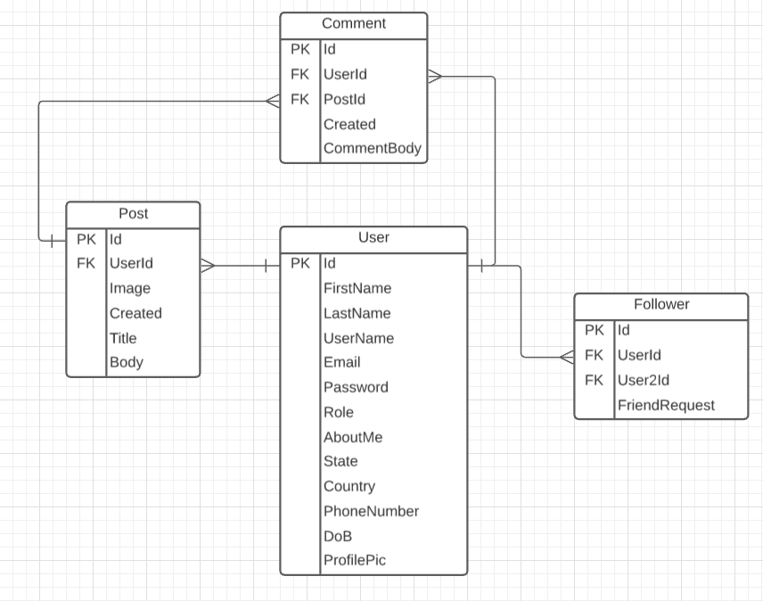

# P2 Social-Media Post'N

## Description

This is a client-server full stack application that utilizes Angular, Asp.Net Core, and Azure SQL DB as a social media website. The application allows a user to register, add/delete friends, create/delte posts and comments and search for other users.

Deployed Website [here](https://postnapp-ui.azurewebsites.net/login)
    

## Table of Contents 
* [Installation](#Installation) 
* [Technologies](#Technologies)
* [License](#License) 
* [Test](#Test) 

    

## Installation

You'll need .NET5, Node.JS, and Entity Framework on a local SQL database. Please note the appsettings.json will need a Connection String for the DB, and a secret for the Json Web Token authorization. 

## Technologies

- C#
- Asp.Net Core 5
- Entity Framework
- Angular
- Azure DB, Web servies, Dev Ops
- Json Web Token
- Bootstrap / Angular Material UI

## ER Diagram

## License
    
This project falls under the mit license. Please visit [mit](https://choosealicense.com/licenses/mit) to learn more.
    

## Test

This application uses Unix Testing for the backend. Simply navigate to the Tests folder and use dotnet test. Angular uses its built in testing for the frontend. 
    

## Questions
The author of this project is Keegan Wedwick, Du Tran, and Chris  You can reach us via [email](mailto:kwedwick@gmail.com).
To see more projects from these authors, visit their GitHub: [Chris](https://github.com/chrism005), [Du](https://github.com/dudutran), [Keegan](https://github.com/kwedwick),
    
   
